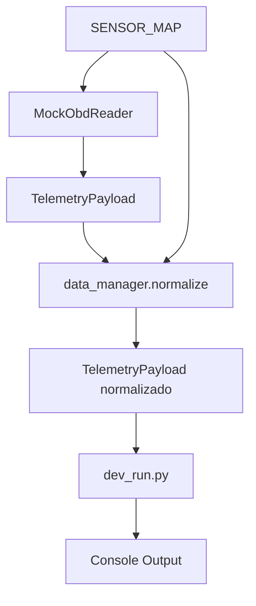
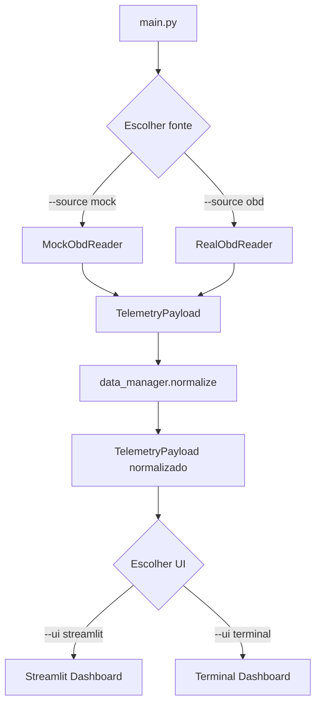

Vou explicar tudo que foi feito até agora, o porquê de cada decisão e como cada parte funciona no contexto do projeto AETHER.

## 📋 Resumo do que foi implementado

### 1. **Contrato de Dados (`utils/types.py`)**
**O que é:** Definições de tipos Python que padronizam como os dados fluem entre os módulos.

**Por que foi feito:** 
- Evita confusão sobre formato dos dados
- Facilita manutenção e testes
- Garante consistência entre mock e OBD real

**Como funciona:**
```python
# Estrutura de cada sensor
SensorValue = {
    "value": 850.0,      # valor numérico (pode ser None)
    "unit": "rpm",       # unidade de medida
    "ok": True,          # se está dentro da faixa válida
    "meta": {"min": 0, "max": 8000}  # metadados opcionais
}

# Payload completo de uma leitura
TelemetryPayload = {
    "timestamp": 1730123456.123,  # época em segundos
    "sensors": {"rpm": SensorValue, "speed": SensorValue, ...},
    "source": "mock",             # "mock" ou "obd"
    "errors": []                  # lista de erros
}
```

### 2. **Leitor Mock (`core/obd_reader.py`)**
**O que é:** Simulador que gera dados plausíveis de sensores automotivos.

**Por que foi feito:**
- Permite desenvolvimento sem hardware OBD-II
- Testa a interface antes de implementar OBD real
- Gera dados realistas para validar dashboards

**Como funciona:**
```python
# Gera valores usando senóides + ruído
def _gen(self, name: str, t: float) -> float:
    meta = SENSOR_MAP[name]
    lo, hi = meta["min"], meta["max"]
    
    # Senóide que varia entre 0 e 1
    base = (math.sin(t / 2.0) + 1.0) / 2.0
    # Adiciona ruído realista
    noise = random.uniform(-0.05, 0.05)
    # Garante que fica entre 0 e 1
    x = max(0.0, min(1.0, base + noise))
    # Escala para faixa do sensor
    return lo + x * (hi - lo)
```

**Exemplo de saída:**
- RPM: 850-8000 rpm (varia suavemente)
- Velocidade: 0-240 km/h
- Temperatura: -40 a 130°C

### 3. **Script de Teste (`dev_run.py`)**
**O que é:** Ferramenta para testar o fluxo completo sem interface gráfica.

**Por que foi feito:**
- Valida se mock + data_manager funcionam juntos
- Debug rápido de problemas
- Demonstra o fluxo de dados

**Como funciona:**
1. Conecta ao mock reader
2. Faz 5 leituras com 1 segundo de intervalo
3. Mostra valores, unidades e status de cada sensor
4. Exibe erros se houver
5. Fecha conexão

**Exemplo de saída:**
```
🚗 AETHER - Teste do Mock Reader
========================================
✅ Conectado: True
📡 Fonte: mock

📊 Leitura 1/5:
  Timestamp: 1730123456.12
  Sensores: 7
  Valores:
    rpm          :   2847.23 rpm   ✅
    speed        :     45.67 km/h  ✅
    coolant_temp :     87.34 °C    ✅
    throttle     :     23.45 %     ✅
    engine_load  :     67.89 %     ✅
    intake_temp  :     34.56 °C    ✅
    map          :    123.45 kPa   ✅
```

## 🔄 Fluxo de Dados Atual



## 🎯 Arquitetura Decidida

### **Separação de Responsabilidades:**
- **`obd_reader.py`**: Só lê dados (mock ou real)
- **`data_manager.py`**: Só processa/normaliza dados
- **`sensor_map.py`**: Só define metadados dos sensores
- **`types.py`**: Só define contratos de dados

### **Vantagens desta abordagem:**
1. **Testável**: Cada módulo pode ser testado isoladamente
2. **Flexível**: Fácil trocar mock por OBD real
3. **Manutenível**: Mudanças em um módulo não afetam outros
4. **Extensível**: Fácil adicionar novos sensores ou fontes

## 🚧 O que ainda falta (próximos passos)

### **Arquivos necessários:**
1. **`core/sensor_map.py`** - Mapa de sensores com PIDs e faixas
2. **`core/data_manager.py`** - Normalização e validação de dados
3. **`ui/streamlit_dashboard.py`** - Interface web
4. **`main.py`** - Ponto de entrada principal

### **Fluxo completo planejado:**


## 💡 Decisões de Design

### **Por que Mock primeiro?**
- Desenvolvimento mais rápido
- Não depende de hardware
- Testa toda a lógica antes de lidar com Bluetooth

### **Por que TypedDict?**
- Tipagem estática sem overhead de classes
- Compatível com dicionários Python normais
- Facilita validação e documentação

### **Por que separar sensor_map?**
- Centraliza configuração de sensores
- Fácil adicionar/remover sensores
- Reutilizável entre mock e OBD real

## 🎮 Como testar agora

```bash
# 1. Criar os arquivos que faltam
# 2. Executar teste
python dev_run.py

# Saída esperada:
# 🚗 AETHER - Teste do Mock Reader
# ========================================
# ✅ Conectado: True
# 📡 Fonte: mock
# ...
```

Quer que eu crie os arquivos que faltam (`sensor_map.py` e `data_manager.py`) para você poder testar o fluxo completo?